<!-- ═══════════════════════════════════════════════════════════════ -->
<!--  TERMINAL PROFILE  —  @surajs1602                                -->
<!--  Header terminal  : assets/terminal.svg                          -->
<!--  Section dividers : assets/divider.svg                           -->
<!--  Snake            : .github/workflows/snake.yml → output branch  -->
<!-- ═══════════════════════════════════════════════════════════════ -->

<!-- Animated terminal — source: assets/terminal.svg (must be committed to the branch being viewed) -->

 

<h3 align="left"><code>$ cat ~/tech-stack</code></h3>

<table align="center">
  <tr>
    <td align="right"><b>Languages</b></td>
    <td></td>
  </tr>
  <tr>
    <td align="right"><b>Cloud&nbsp;&amp;&nbsp;DevOps</b></td>
    <td></td>
  </tr>
  <tr>
    <td align="right"><b>Frameworks&nbsp;&amp;&nbsp;Data</b></td>
    <td></td>
  </tr>
</table>

`REST APIs` · `Microservices` · `MuleSoft` · `Guidewire ClaimCenter` · `FAISS` · `pgvector` · `Pinecone`

<h3 align="left"><code>$ git log --stat</code></h3>

<!-- NOTE: github-readme-stats.vercel.app (503 DEPLOYMENT_PAUSED) and
     github-profile-trophy.vercel.app (402) are both dead upstream.
     Using github-profile-summary-cards, which is live. -->

 

 

 

<h3 align="left"><code>$ ./contribution_snake.sh</code></h3>

<!-- Generated by .github/workflows/snake.yml onto the `output` branch.
     Run that workflow once (Actions → Generate Snake → Run workflow) or these 404. -->
<picture>
  <source media="(prefers-color-scheme: dark)" srcset="https://raw.githubusercontent.com/surajs1602/surajs1602/output/github-contribution-grid-snake-dark.svg" />
  <source media="(prefers-color-scheme: light)" srcset="https://raw.githubusercontent.com/surajs1602/surajs1602/output/github-contribution-grid-snake.svg" />
  
</picture>

<h3 align="left"><code>$ ping ~/reach-me</code></h3>

 

&nbsp;
&nbsp;
&nbsp;

  

<!---
surajs1602/surajs1602 is a ✨ special ✨ repository because its `README.md` (this file) appears on your GitHub profile.
You can click the Preview link to take a look at your changes.
--->
